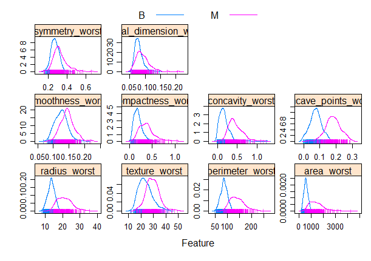

# Introduction
Breast cancer is a disease in which cells in the breast grow out of control, and it counts for 15% of all cancer cases over the world, it's also the most common cancer among women. A very important thing for breast cancer is to classify the tumours as malignant or benign, which will be the key of our project.

The data set we are going to use contain 569 observations with 30 predicting variables and 1 response variable which is whether the tumour is classified as malignant or benign. The detailed explanation of each variable can be found in *Table 1*.

From the 569 observations, we have 212 observations classified as malignant and 357 classified as benign. For the project, we will first try to use statistical modelling to predict the classification of the tumour, and then use clustering methods as an unsupervised learning tool. 

# Visualisation of the Data Set
As our response variable is binary, we decide to use the **featurePlot()** function to visualise the density distribution of the 30 explanatory variables, under malignant and benign.(*Figure 1*) According to Figure1, the compactness mean, concavity mean, concave points mean, radius mean, perimeter mean, area mean, perimeter se, area se, worst compactness, worst comcavity, worst concave points, worst radius, worst perimeter and worst area seems to have very different distributions between malignant and benign. So we may say that these variables may have a more significant effect on tumour classification compared to the other variables. Also, the malignant distribution of these variables from the plot is always to the right of the benign distribution, it means the higher the values of these variables, the higher the probability that the tumour is malignant.  

Furthermore, the two distributions of symmetry se, fractal dimension se, texture se, smoothness se from the plot are almost overlapped, so we may say that these variables might not have any significant effect in tumour classifications. 

#  Models Training
In this study, we can get a data frame which includes 569 rows and 31 columns (the original data set includes no NA data, so we don’t need to fill the missing values), the row names of the data set is the ID of each observation, and the response of this data set is “diagnosis” (to make it easier to fit the model, we changed “M” into “neg” while “B” into “pos”). Then we randomly extracted 70% of the data to be train data and the 30% rest to be test data.

To find out the relationship between different predictors and life expectancy, I decided first to find out the best fitted model. So I built KNN, glm, penalized logistic regression, GAM, MARS, LDA, QDA, NB, classification tree, CIT, Random Forests, SVM in total 11 kinds of models using **caret** package. In all of the models, I conducted a 10-fold cross validation method for binary response to get a better model.

# Weakness of different models
## KNN
The first model I used to fit is KNN model. The weakness of KNN is\
1. High computational complexity; high spatial complexity.\
2. Low prediction accuracy for rare categories when the sample is not balanced\
3. Poor interpretability, cannot give rules like decision trees.

In the KNN model, the tuning parameter is "k", after training with the area (1,20), we can learn that the best tuning parameter k is 29. Then I input the training data set and arrange y = life expectancy, x = 30 variables.

By calculating the training and test error rates using the test data set, we can find that the training and test error rates of the KNN model are 0.085 and 0.059. Therefore, I think the KNN model is flexible enough to capture the underlying truth.

## GLM
Then I used general linear regression model, whose weakness is being difficult to interpret the correlation coefficient if the features are highly correlated.

There is no any tuning parameters in the GLM model, so I simply input the training data set and arrange y and x.

By calculating the training and test error rates using the test data set, we can find that the training and test error rates of the GLM model are 0 and 0.059. Therefore, I think this model is also flexible enough to capture the underlying truth.

## Penalized Logistic Regression
The weakness of penalized logistic regression model is introducing a small amount of bias into the model, but greatly reduces the variance.

This model has 2 tuning parameters $\lambda$ and $\alpha$ (0-1). Based on the rule, I tried different area of lambda and finally decided to set –8 < $\lambda$ < -1 as the area of $\lambda$, and get the best tuning parameters $\lambda = 0.012$, $\alpha = 0.15$.

By calculating the training and test error rates using the test data set, we can find that the training and test error rates of the penalized logistic regression model are 0.020 and 0.006. Therefore, I think this model is flexible enough to capture the underlying truth.

## GAM
The weakness of GAM model is lack of parametric functional form makes it difficult to score the new data directly.

The tuning parameter of GAM model is "select" and “method. If it is "TRUE" then GAM can add an additional penalty variable to each semester so that it can be scored as zero. This means that the smoothing parameter estimate is part of the fit and can be completely removed from the terms in the model. If the corresponding smoothing parameter estimate is zero, then the additional penalty has no effect. In this project, the "select" is "TRUE" and the “method” is “GCV.Cp”.

By calculating the training and test error rates using the test data set, we can find that the training and test error rates of the GAM model are 0 and 0.053. Therefore, I think this model is flexible enough to capture the underlying truth.

## MARS
Although MARS has the weakness of requiring strict assumptions and the need to deal with outliers, MARS is not only highly adaptive compared to other methods, but also has a higher accuracy for model prediction. In the multidimensional case, due to the expansion of the sample space, how to divide the space becomes a crucial issue. MARS is a regression method with high generalization ability specifically for high-dimensional data. This regression method uses the tensor product of the spline function as the basis function, and the determination of the basis function (the number of tensor variables and the partition point of the variables) and the number of basis functions are done automatically by the data, without manual selection. 

In the MARS model, after trying several times, I decided to take degree = 1-4, nprune = 1-30 to be the area of the tuning parameters. After training the model with caret package, it is reported that degree = 1 and nprune = 9 are the best tuning parameters that will lead to a model with the largest AUC.

By calculating the training and test error rates using the test data set, we can find that the training and test error rates of the LDA model are 0.020 and 0.018. Therefore, I think this model is flexible enough to capture the underlying truth.

## LDA
The weakness of the LDA model is not suitable for dimensionality reduction of non-Gaussian distributed samples; can reduce at most 1 dimension, and the improved algorithm of LDA can solve the problem of multi-dimensional dimensionality reduction; not effective in dimensionality reduction when the sample classification information relies on variance rather than mean; and may over-fit the data

There are no any tuning parameters in the LDA model, so I simply input the training data set and arrange y and x.

By calculating the training and test error rates using the test data set, we can find that the training and test error rates of the LDA model are 0.038 and 0.035. Therefore, I think this model is also flexible enough to capture the underlying truth.

## QDA
QDA increases the complexity of the model by unqualifying the LDA.

There are no any tuning parameters in the QDA model, so I simply input the training data set and arrange y and x.

By calculating the training and test error rates using the test data set, we can find that the training and test error rates of the QDA model are 0.028 and 0.059. Therefore, I think this model is also flexible enough to capture the underlying truth.

## Naive Bayes (NB)
The condition of attribute uniqueness is a disadvantage of the NB. The uniqueness of the attributes of the dataset is difficult to be satisfied in many cases, because the attributes of the dataset are often interrelated. If this problem occurs in the classification process, it will lead to a significant reduction in the effectiveness of the classification.

In the NB model, after trying several times, I decided to take fL = 1, 0.2 < adjust < 3 to be the area of the tuning parameters. After training the model with caret package, it is reported that adjust = 1 are the best tuning parameters that will lead to a model with the largest AUC.

By calculating the training and test error rates using the test data set, we can find that the training and test error rates of the QDA model are 0.060 and 0.059. Therefore, I think this model is also flexible enough to capture the underlying truth.

## Tree based methods
The tree based methods are simple and useful for interpretation, however, a single tree may not be as accurate as the best supervised learning approaches in prediction. 

The best tuning parameter of our classification tree is cp = 0.00358 and the final tree size is 5. The best tuning parameter of our CIT is mincriterion = 0.812.  In the random forest model, after trying several times, I decided to take 1 < mtry <8,splitrule = "gini" and 2 < min.node.size < 10 to be the area of the tuning parameters. The best tuning parameter of our random forest model is mtry = 3 and min.node.size = 6. By calculating the training and test error rates using the test data set, we can find that the training and test error rates of the classification tree model are 0.038 and 0.041; the training and test error rates of CIT are 0.048 and 0.047; the training and test error rates of random forest model are 0.003 and 0.029. Therefore, I think these models are flexible enough to capture the underlying truth.

## SVM
The weakness of SVM is that this model is hard to be interpreted, requires a large amount of memory and requires great care in pre-processing the data and in the adjustment of parameters.

We first fitted the linear kernel SVM, using both “svmlinear” and “svmlinear2”,The best tuning parameter for these 2 models are both C=0.008 (within $e^{-5}<C<e^2$).

We first fitted the linear kernel SVM, using “svmRadialSigma”, the best tuning parameters for this model is both Sigma = 0.031, C = 3.929 (within $e^{-6}<Sigma<e^{-2}$ and $e^{-1}<C<e^4$). We also fitted the model using “svmRadialCost”,  the best tuning parameters for this model is both C = 3.020 (within $e^{-3}<C<e^3$).

Then we fitted the radial kernel SVM, using both "svmRadialSigma" and "svmRadialCost".  

## Clustering
The weakness of k-mean clustering is that, for outlier and noise point sensitivity, the choice of k-value is difficult to determine, and only spherical clusters can be found, and the result may be only a local optimum rather than a global optimum.

In this model, we set the tuning parameters centers = 2 and nstart = 20. 
By calculating the full model error rates using the test data set, we can find that the error rate of the k-mean cluster model is larger than 0.5 Therefore, we think this model is not flexible enough to capture the underlying truth.

# Comparison and Model Selection
To find out the best fitting model, we compared their goodness of fit by comparing the RMSE. 

The result of the comparison through cross validation is shown in *Figure 2*.

From the comparison of both cross validation, we can find that the Penalized Logistic Regression model and radial kernel SVM model have similar ROC results, and both of their ROC are the highest. Since in this study, interpreting the probability of the  benign and malignant tumour will make the interpretation more clearly, we decided to choose the **Penalized Logistic Regression model** to be our final model. Also, from the data visualisation part, the density distributions of some variables among malignant and benign  are very similar, which means the data set is not clearly separable, therefore, logistic regression will be a better choice. 

# Selected Model Interpretation
In order to have a general idea of how these variables may affect the tumour classificaiton, we plot a vip importance plot of the penalised logistic regression model as shown in *Figure 3*. We can find that the changes in “fractal dimension se", “concave point se", “max fractal dimension", “mean fractal dimension”, "smoothness se", "mean concave points", "compactness se", “symmetry se”, “max smoothness”,  and "mean symmetry" will lead to an observable change in breast cancer types. So these variables above play important roles in predicting the tumour classification. 

Since this model is a logistic regression model, we can consider that when the slope of the pdp plot of one of the variables is larger than 0, $\frac{prob(pos)}{prob(neg)} = \frac{prob(benign breast cancer)}{prob(malignant breast cancer)}$ will have a trend of positive relationship with this variable on average, which means the diagnosis result is more likely to be benign breast cancer on average. 

From the slope of pdp partial plots (*Figure 4*) and the coefficient, we can find than among the 8 important predictors, a higher  "concave points se", “max fractal dimension",  "smoothness se",  "mean concave points'', “max smoothness” will all lead to a trend of higher possibility to get benign breast cancer on average (the slopes of pdp plots of these variables are larger than 0), while patients with higher results of the rest  4 important variables will lead to a trend of higher possibility to get malignant breast cancer. 

# Discussion
Our modelling results are quite different from our previous data exploration, our feature plot shows that the distributions for fractal dimension se between malignant and benign tumours are quite similar, however, our model results shows that it is the most significant variable that can affect the tumour classification. Also, some variables such as concavity mean and radius mean that show very different distributions between malignant and benign turns out to be insignificant predictors in our model.This might be because the underlying truth cannot be captured by data visualisation or the data set is not large enough as we have so many prediction variables. Furthermore, the clustering method seems not good in this case, this might be because our data is a supervised learning data with a response variable. As k-mean clustering is for unsupervised learning data without knowing the underlying subgroups, it might not be a good choice here.

For future investigations, as our penalised logistic regression doesn’t consider interaction between variables, we may try to also consider interactions when modelling for further investigation.  

\newpage
{width=100%}

{width=100%}
{width=100%}
{width=100%}

{width=100%}

{width=100%}

{width=100%}
